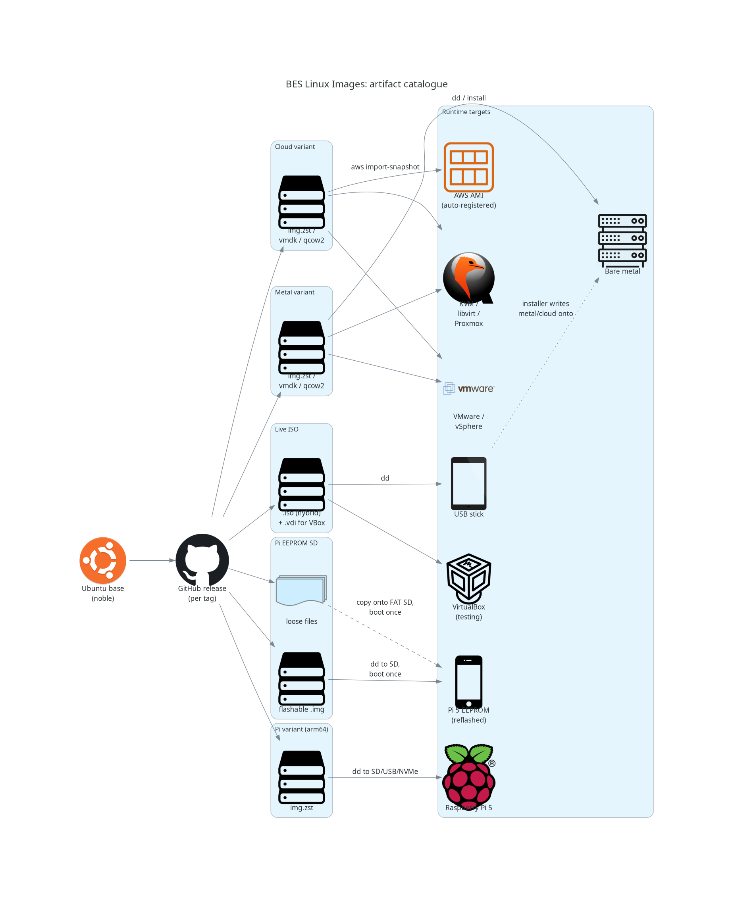
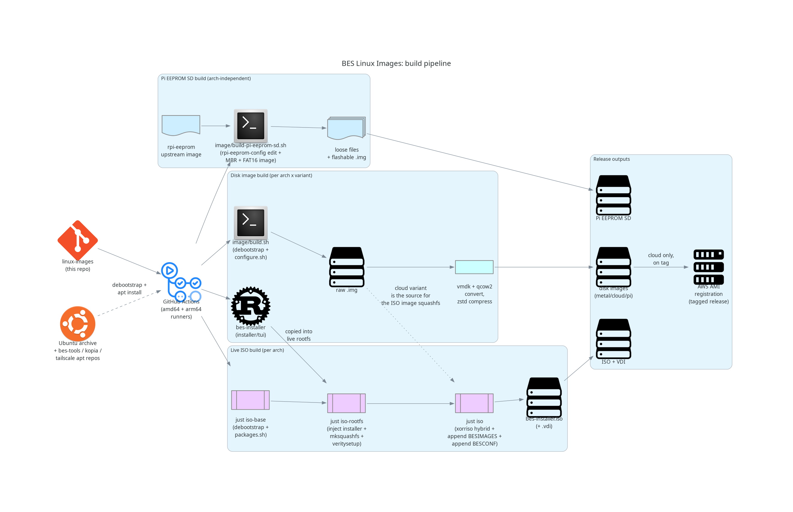
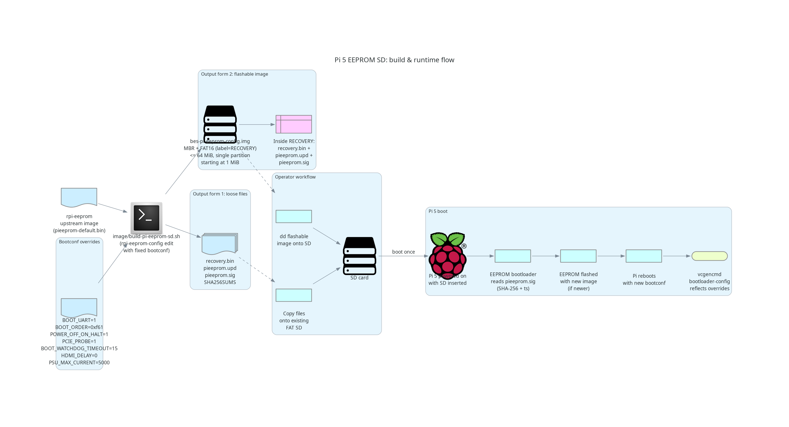
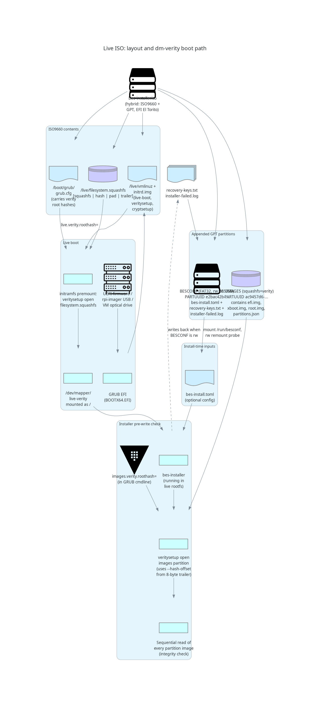
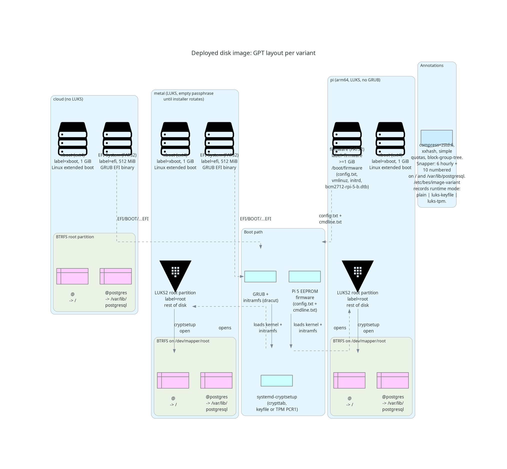

# Architecture: artifacts, build pipeline, layouts

This is a developer-facing tour of what this repo produces and how. It is
not a setup guide — see [GUIDE-IMAGES.md](./GUIDE-IMAGES.md) and
[GUIDE-INSTALLER.md](./GUIDE-INSTALLER.md) for that. The diagrams in
[`./diagrams/`](./diagrams/) are rendered from the Python sources in the
same directory; rebuild them with `uv run python <name>.py`.

## What we ship

Each tagged release publishes three families of artifact:

- **Disk images** in three variants (`cloud`, `metal`, `pi`), each in
  three formats (`.img.zst`, `.vmdk`, `.qcow2`). The `cloud` variant has
  a plaintext root partition; `metal` and `pi` are encrypted with LUKS.
- **A live ISO** (per architecture) which contains the bes-installer TUI
  and a copy of the `cloud` image to write onto the target disk. Also
  produced as a `.vdi` for VirtualBox testing.
- **A Pi 5 EEPROM SD artifact** (architecture-independent) that
  reflashes a Pi 5's bootloader EEPROM with our standard config when
  inserted and powered on once.

For tagged releases, the cloud-variant images are additionally
registered as AWS AMIs in `ap-southeast-2`.

## How they're built

The justfile drives three independent build flows, all running on
GitHub Actions amd64 and arm64 runners:

- **Disk image build** (`just raw` etc.): debootstrap → configure.sh →
  raw .img → vmdk + qcow2 + zstd compress.
- **Live ISO build** (`just iso-base` → `iso-rootfs` → `iso`): a
  separate debootstrap for the live environment, the installer binary
  injected from the Rust workspace, mksquashfs + veritysetup over the
  rootfs, then xorriso assembles the hybrid ISO with two appended
  partitions (BESIMAGES squashfs + BESCONF FAT32). The cloud image is
  the *source* for the BESIMAGES squashfs — it is what the installer
  copies onto the target disk.
- **Pi EEPROM SD build**: `image/build-pi-eeprom-sd.sh` edits the
  upstream `rpi-eeprom` image with our fixed bootconf and produces both
  a directory of loose files and a flashable raw `.img`.

Detailed bootconf overrides and the on-Pi reflash flow are documented in
the spec at [docs/spec/pi-eeprom-sd.md](./spec/pi-eeprom-sd.md):

## ISO on-disk layout

The ISO is a hybrid ISO9660 / GPT image. Inside the ISO9660 part: GRUB
config, the kernel + initramfs, and the live rootfs squashfs (with a
verity hash tree appended and a self-describing 8-byte trailer). Outside
that, two GPT partitions are appended via `xorriso --append_partition`:

- **BESIMAGES** (squashfs + verity, well-known PARTUUID): contains the
  raw `efi.img`, `xboot.img`, `root.img` and `partitions.json` that the
  installer streams onto the target disk.
- **BESCONF** (FAT32, well-known PARTUUID): mostly read-only on optical
  media; writable when the ISO has been `dd`'d to USB. Holds the
  optional `bes-install.toml` and receives `recovery-keys.txt` and
  `installer-failed.log` written back by the installer.

Both verity-protected blobs use the same `[data | hash | pad | trailer]`
layout described in `r[iso.verity.layout+3]`. The root hashes are
embedded in the GRUB kernel cmdline as `live.verity.roothash=` and
`images.verity.roothash=`. The installer performs an upfront sequential
read of every partition image to force verity to verify every block
*before* writing anything to the target disk.

## Deployed disk layout

All three variants share the same partition skeleton: an EFI/firmware
partition, an `xboot` extended-boot partition, and a `root` partition
filling the rest of the disk. The differences are:

- **cloud** — root is BTRFS directly on the partition; no encryption.
  Boots via GRUB.
- **metal** — root is LUKS2 with an empty passphrase at build time; the
  installer rotates it. BTRFS goes on `/dev/mapper/root`. Boots via
  GRUB.
- **pi** — same as metal, but boots via the Pi 5 EEPROM firmware (no
  GRUB). The `firmware` partition holds `config.txt`, `cmdline.txt`,
  `vmlinuz`, `initrd.img`, and the Pi-specific DTB + overlays.

The BTRFS filesystem always carries two subvolumes: `@` mounted at `/`,
and `@postgres` mounted at `/var/lib/postgresql`. Both are quota'd via
BTRFS simple quotas and snapshotted by snapper (6 hourly + 10 numbered).
The runtime mode (`plain`, `luks-keyfile`, or `luks-tpm`) is recorded in
`/etc/bes/image-variant`, which the installer overwrites for non-Pi
variants.
