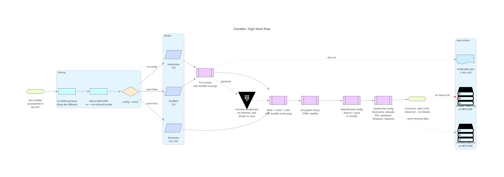
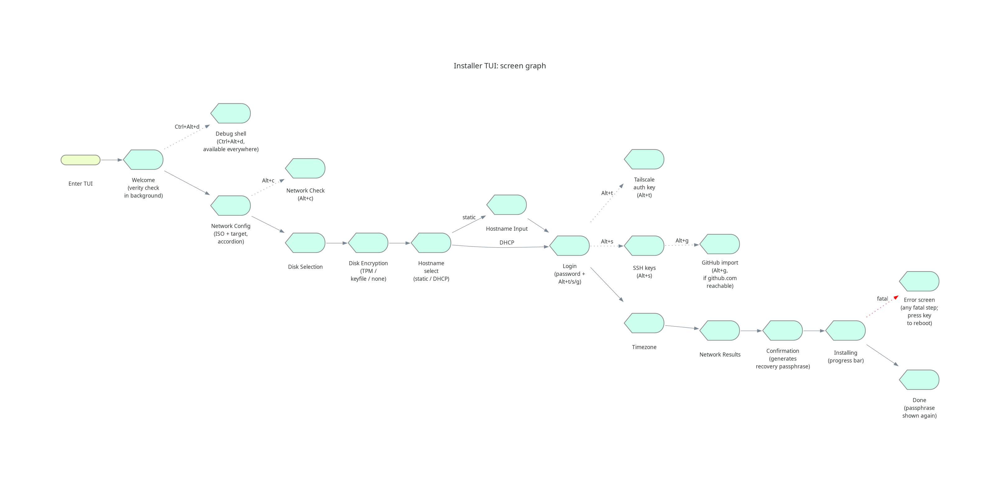
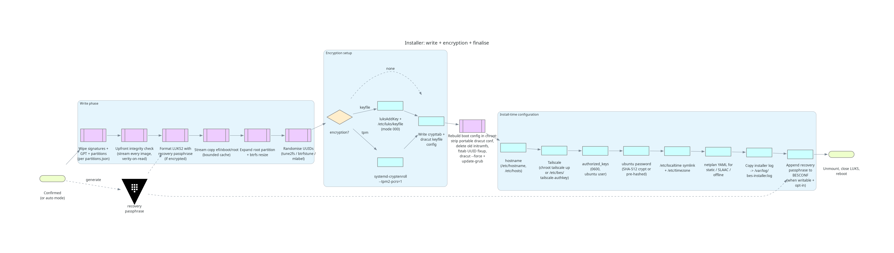

# Architecture: the installer

Developer-facing tour of `bes-installer`, the Rust TUI in
[`installer/tui`](../installer/tui). For end-user usage see
[GUIDE-INSTALLER.md](./GUIDE-INSTALLER.md). The diagrams in
[`./diagrams/`](./diagrams/) are rendered from the Python sources in the
same directory.

## High-level flow

`bes-installer` is autostarted on tty1 by the live ISO. Before anything
else it runs a CD-ROM partscan (so the appended GPT partitions become
visible when booted as optical media), mounts the BESCONF partition
read-only and probes for writability with a remount, then loads
`bes-install.toml` if present. From there it picks one of three modes:

- **Interactive** — no config file; full TUI with sensible defaults.
- **Prefilled** — config file present, `auto = false`; TUI with values
  pre-filled.
- **Automatic** — `auto = true`; no TUI, runs straight through.

Modes converge on the same write → encrypt → rebuild boot config →
finalise → reboot tail. The recovery passphrase is generated up front
(at confirmation time interactively, or before the write phase in auto
mode) so that it's available as the initial LUKS key before the root
partition is formatted; the same passphrase is shown to the user and
optionally appended to BESCONF as `recovery-keys.txt`.

Two side artifacts deserve attention:

- `--dry-run` skips all destructive operations and emits a JSON install
  plan describing what *would* happen — used by the test harness.
- On any fatal error, when BESCONF is writable, the installer's log file
  is copied to `installer-failed.log` so it can be read on another
  machine after pulling the USB.

## TUI screen graph

The main flow is a linear sequence of full-screen views. Sub-screens
hang off the screens that own their data:

- **Network Check** (`Alt+c`) is a diagnostic view of the background
  connectivity probes started on the Network Config screen, plus
  `tailscale netcheck` output.
- **Tailscale auth key** (`Alt+t`), **SSH keys** (`Alt+s`), and
  **GitHub import** (`Alt+g` — only if `github.com` is reachable) are
  all reachable from the Login screen. GitHub import appends fetched
  keys into the SSH keys screen rather than back to Login.
- **Debug shell** (`Ctrl+Alt+d`) is available everywhere; the keybind is
  only advertised on the welcome screen but works from any screen.

The Confirmation screen is the point at which the recovery passphrase is
generated and shown; the Done screen displays it again so the user has a
second chance to record it before the system reboots.

## Write, encryption, and finalise

After confirmation (or immediately, in auto mode), the installer:

1. **Wipes** all signatures on the target disk and lays out the GPT
   from `partitions.json`.
2. Performs an **upfront integrity check** by streaming every partition
   image — this forces dm-verity to verify every block of the BESIMAGES
   partition before anything is written, so a corrupt installer medium
   fails *before* touching the target disk.
3. **Formats the LUKS2 volume** with the recovery passphrase as the
   initial key (when encryption is on), then opens it.
4. **Stream-copies** the partition images onto the target. The copy is
   bounded — neither the source page cache nor the destination page
   cache is allowed to accumulate, so even multi-GiB images install on
   a 2 GiB-RAM machine without invoking the OOM killer.
5. **Expands** the root partition / LUKS volume / BTRFS to fill the
   disk, then **randomises** every filesystem UUID so each install is
   unique.

Encryption setup happens after UUID randomisation: enroll the chosen
unlock mechanism (TPM PCR 1, or a 4096-byte random keyfile on the boot
partition), then write the crypttab and the dracut keyfile config into
the target rootfs.

The boot config is then rebuilt **inside a chroot** of the freshly
installed system: the portable dracut config is stripped, the
image-build initramfs is deleted (its embedded UUIDs are now stale),
fstab is temporarily rewritten to use UUIDs (so dracut hostonly mode
resolves the right devices in container builds where udev hasn't
caught up), and finally `dracut --force` and `update-grub` produce a
target-specific initramfs and grub.cfg.

Install-time configuration is the final pre-reboot step: hostname,
Tailscale auth (either chrooted `tailscale up` or a first-boot key file,
depending on whether netcheck passed), authorized_keys, password,
timezone, target-network netplan, the installer log, and the recovery
passphrase append (when opt-in and BESCONF is writable). Everything is
unmounted, LUKS volumes closed, and the system reboots — unless
`--no-reboot` was passed (used by container-based integration tests).
